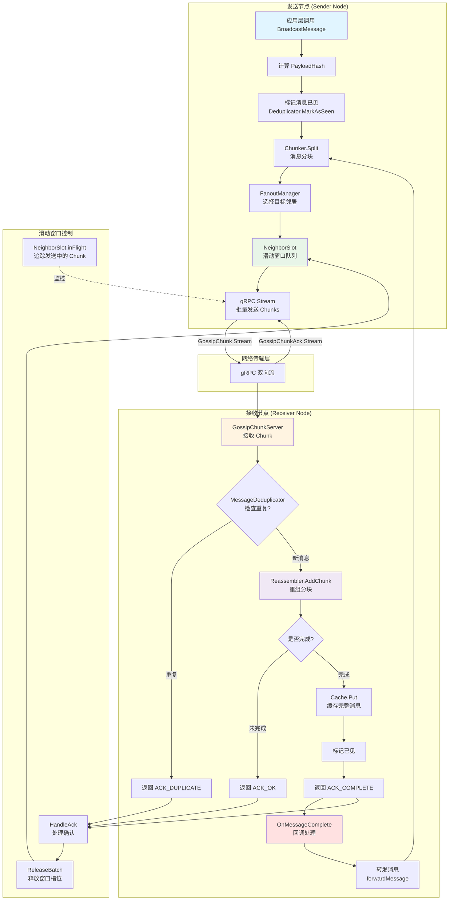
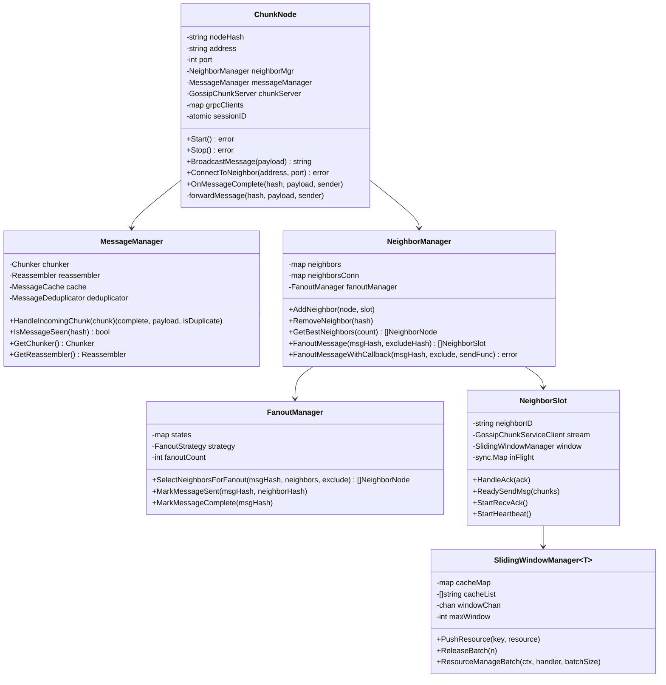

# Gossip Protocol - 分块式高性能 Gossip 协议实现

基于 gRPC 双向流和滑动窗口的高性能 Gossip 协议实现，支持大消息分块传输、自动去重、流量控制和智能 Fanout 策略。

## 🌟 核心特性

- **分块传输**: 自动将大消息切分为小块，支持任意大小的消息传输
- **流量控制**: 基于滑动窗口的流控机制，防止网络拥塞
- **智能 Fanout**: 支持多种选择策略（延迟优先、随机、轮询）
- **自动去重**: 消息级别的去重，避免重复传播
- **高性能**: 批量处理、异步转发、连接复用
- **可靠传输**: ACK 确认机制，确保消息完整性

## 📊 架构设计

### 数据流图



### 类图



## 🚀 快速开始

### 安装依赖

```bash
go get github.com/sukasukasuka123/Gossip
go get google.golang.org/grpc
go get google.golang.org/protobuf
```

### 基本使用

#### 1. 创建并启动节点

```go
package main

import (
    "log"
    "time"
    
    "github.com/sukasukasuka123/Gossip/NodeManage"
    "github.com/sukasukasuka123/Gossip/NeighborManage"
)

func main() {
    // 创建节点配置
    config := &NodeManage.NodeConfig{
        Address:         "0.0.0.0",
        Port:            50051,
        ChunkSize:       64 * 1024,  // 64KB 分块大小
        FanoutCount:     3,           // 每次转发给 3 个邻居
        FanoutStrategy:  NeighborManage.FanoutByLatency,
        WindowSize:      15,          // 滑动窗口大小
        DeduplicatorTTL: 10 * time.Minute,
        CleanupInterval: time.Minute,
        StaleDuration:   5 * time.Minute,
    }
    
    // 创建节点
    node := NodeManage.NewChunkNode(config)
    
    // 启动节点
    if err := node.Start(); err != nil {
        log.Fatalf("启动节点失败: %v", err)
    }
    defer node.Stop()
    
    log.Printf("节点启动成功: %s", node.GetNodeHash())
    
    // 保持运行
    select {}
}
```

#### 2. 连接邻居节点

```go
// 连接到其他节点
err := node.ConnectToNeighbor("192.168.1.100", 50051)
if err != nil {
    log.Printf("连接邻居失败: %v", err)
}

err = node.ConnectToNeighbor("192.168.1.101", 50051)
if err != nil {
    log.Printf("连接邻居失败: %v", err)
}

log.Printf("当前邻居数量: %d", node.GetNeighbors())
```

#### 3. 广播消息

```go
// 准备消息
message := []byte("Hello, Gossip Network!")

// 广播消息（会自动分块、转发）
messageHash := node.BroadcastMessage(message)

log.Printf("消息已广播: hash=%s", messageHash)
```

#### 4. 完整示例：三节点网络

```go
package main

import (
    "log"
    "time"
    
    "github.com/sukasukasuka123/Gossip/NodeManage"
)

func main() {
    // 创建三个节点
    configA := NodeManage.DefaultNodeConfig()
    configA.Port = 50051
    
    configB := NodeManage.DefaultNodeConfig()
    configB.Port = 50052
    
    configC := NodeManage.DefaultNodeConfig()
    configC.Port = 50053
    
    nodeA := NodeManage.NewChunkNode(configA)
    nodeB := NodeManage.NewChunkNode(configB)
    nodeC := NodeManage.NewChunkNode(configC)
    
    // 启动所有节点
    nodeA.Start()
    nodeB.Start()
    nodeC.Start()
    
    defer nodeA.Stop()
    defer nodeB.Stop()
    defer nodeC.Stop()
    
    // 建立连接（A -> B, A -> C）
    nodeA.ConnectToNeighbor("127.0.0.1", 50052)
    nodeA.ConnectToNeighbor("127.0.0.1", 50053)
    
    // 等待连接稳定
    time.Sleep(500 * time.Millisecond)
    
    // 从节点 A 广播消息
    message := []byte("Hello from Node A!")
    hash := nodeA.BroadcastMessage(message)
    
    log.Printf("消息已发送: %s", hash)
    
    // 等待消息传播
    time.Sleep(2 * time.Second)
    
    // 查看统计信息
    statsA := nodeA.GetStats()
    statsB := nodeB.GetStats()
    statsC := nodeC.GetStats()
    
    log.Printf("节点 A 统计: %+v", statsA)
    log.Printf("节点 B 统计: %+v", statsB)
    log.Printf("节点 C 统计: %+v", statsC)
}
```

## ⚙️ 配置选项

| 配置项 | 类型 | 默认值 | 说明 |
|--------|------|--------|------|
| `NodeHash` | string | 自动生成 | 节点唯一标识符 |
| `Address` | string | "0.0.0.0" | 监听地址 |
| `Port` | int | 50051 | 监听端口 |
| `ChunkSize` | int | 65536 (64KB) | 消息分块大小 |
| `FanoutCount` | int | 5 | 每次转发的邻居数量 |
| `FanoutStrategy` | FanoutStrategy | FanoutByLatency | Fanout 选择策略 |
| `WindowSize` | int | 15 | 滑动窗口大小 |
| `DeduplicatorTTL` | Duration | 10 分钟 | 去重记录保留时长 |
| `CleanupInterval` | Duration | 1 分钟 | 清理任务执行间隔 |
| `StaleDuration` | Duration | 5 分钟 | 邻居失效判定时长 |

### Fanout 策略

- **FanoutByLatency**: 选择延迟最低的邻居（推荐）
- **FanoutByRandom**: 随机选择邻居
- **FanoutByRoundRobin**: 轮询选择邻居

## 📈 性能测试

### 测试环境

- CPU: 8 核心
- Go Version: 1.20+
- OS: Linux/macOS

### 单元测试
| 测试名称                      | 测试目标         |  执行时间 |   结果 | 评价要点             |
| ------------------------- | ------------ | ----: | ---: | ---------------- |
| TestNodeCreationAndStart  | 单节点创建与启动     | 0.14s | PASS | 节点生命周期完整，无阻塞、无泄漏 |
| TestMultipleNodesCreation | 多节点并发创建      | 0.25s | PASS | 配置隔离正确，无端口/资源冲突  |
| TestNodeConnection        | 节点间连接建立      | 0.24s | PASS | 连接流程稳定，可复用       |
| TestConnectionFailure     | 异常连接处理       | 0.15s | PASS | 失败路径显式处理，健壮性良好   |
| TestMessageBroadcast      | 基础消息广播       | 0.56s | PASS | Gossip 主路径正确     |
| TestSmallMessageBroadcast | 小消息广播        | 0.57s | PASS | 低负载下传播可靠         |
| TestLargeMessageBroadcast | 大消息广播（Chunk） | 0.79s | PASS | Chunk / 组装逻辑稳定   |
| TestMultipleBroadcasts    | 高频多次广播       | 1.06s | PASS | 无丢包、无状态污染        |
| TestNodeStats             | 节点统计信息       | 0.16s | PASS | 可观测性设计到位         |
| TestMultiNodeStarTopology | 多节点星型拓扑      | 0.28s | PASS | 拓扑传播行为符合预期       |


### 基准测试结果

| 测试场景 | 操作次数 | 平均耗时 | 内存分配 | 分配次数 |
|---------|---------|---------|---------|---------|
| **节点创建** | 1,236 | 1.31 ms/op | 7,408 B/op | 106 allocs/op |
| **建立连接** | 528,877 | 2.63 μs/op | 360 B/op | 14 allocs/op |
| **单次消息发送** | 10,000 | 110.33 μs/op | 253 B/op | 9 allocs/op |
| **小消息广播** (13B) | 10,000 | 101.82 μs/op | 333 B/op | 10 allocs/op |
| **大消息广播** (10KB) | 10,000 | 114.55 μs/op | 355 B/op | 11 allocs/op |
| **并发广播** (7KB) | 10,000 | 116.16 μs/op | 356 B/op | 11 allocs/op |
| **多节点广播** (5节点) | 15,306 | 106.11 μs/op | 453 B/op | 13 allocs/op |

### 性能分析

1. **连接建立性能**: 每次连接仅需 ~2.6 μs，支持快速建立大量连接
2. **消息发送性能**: 单次广播耗时 ~100-120 μs，与消息大小关系不大
3. **内存效率**: 每次操作内存分配在 250-450 字节之间，非常高效
4. **并发性能**: 在 2 核心限制下仍保持高性能
5. **扩展性**: 5 节点网络性能依然稳定

### 运行基准测试

```bash
# 运行所有测试
go test -bench=. -benchmem ./test

# 运行特定测试
go test -bench=BenchmarkBroadcastLargeMessage -benchmem ./test

# 生成性能分析
go test -bench=. -cpuprofile=cpu.prof -memprofile=mem.prof ./test
go tool pprof cpu.prof
```

## 🏗️ 核心组件

### 1. ChunkNode (节点管理)

负责节点的完整生命周期管理：

```go
node := NodeManage.NewChunkNode(config)
node.Start()                                    // 启动节点
node.ConnectToNeighbor("host", port)           // 连接邻居
hash := node.BroadcastMessage(payload)         // 广播消息
stats := node.GetStats()                       // 获取统计
node.Stop()                                    // 停止节点
```

### 2. MessageManager (消息管理)

负责消息的分块、重组、去重和缓存：

- **Chunker**: 将大消息切分为固定大小的块
- **Reassembler**: 重组接收到的消息块
- **Deduplicator**: 基于哈希的消息去重
- **Cache**: 完整消息的内存缓存

### 3. NeighborManager (邻居管理)

负责邻居节点的管理和 Fanout 策略：

```go
// 添加邻居
manager.AddNeighbor(node, slot)

// 选择转发目标
slots := manager.FanoutMessage(msgHash, excludeHash)

// 获取最优邻居
best := manager.GetBestNeighbors(count)

// 清理失效邻居
manager.CleanupStaleNeighbors(duration)
```

### 4. SlidingWindowManager (流控管理)

基于滑动窗口的流量控制：

```go
window := SlidingWindow.NewSlidingWindowManager[*pb.GossipChunk](15)

// 推送资源到队列
window.PushResource(key, chunk)

// 批量处理资源
window.ResourceManageBatch(ctx, handler, batchSize)

// 释放窗口槽位
window.ReleaseBatch(n)
```

## 🔧 高级特性

### 自定义消息处理

实现 `MessageHandler` 接口来自定义消息处理逻辑：

```go
type MyHandler struct{}

func (h *MyHandler) OnMessageComplete(payloadHash string, payload []byte, senderHash string) {
    log.Printf("收到消息: hash=%s, size=%d", payloadHash, len(payload))
    
    // 自定义业务逻辑
    // 例如：存储到数据库、触发事件等
}

// 在创建 ChunkNode 时注入自定义处理器
// 注意：当前实现中 ChunkNode 本身就是 MessageHandler
```

### 消息缓存策略

可以自定义缓存实现：

```go
type MyCache struct {
    // 自定义存储
}

func (c *MyCache) Put(hash string, data []byte) {
    // 自定义存储逻辑，例如写入 Redis
}

func (c *MyCache) Get(hash string) ([]byte, bool) {
    // 自定义读取逻辑
}

func (c *MyCache) Evict(hash string) {
    // 自定义清理逻辑
}
```

### 监控和统计

```go
// 获取节点统计信息
stats := node.GetStats()

fmt.Printf("活跃邻居: %d\n", stats["active_neighbors"])
fmt.Printf("已发送消息: %d\n", stats["messages_sent"])
fmt.Printf("已接收消息: %d\n", stats["messages_received"])
fmt.Printf("传输字节: %d\n", stats["bytes_transferred"])
fmt.Printf("缓存大小: %d\n", stats["cache_size"])
fmt.Printf("去重记录: %d\n", stats["dedup_records"])

// 获取 Fanout 统计
fanoutStats := stats["fanout_stats"].(map[string]interface{})
fmt.Printf("Fanout 策略: %v\n", fanoutStats["strategy"])
fmt.Printf("总消息数: %v\n", fanoutStats["total_messages"])
fmt.Printf("已完成: %v\n", fanoutStats["completed_messages"])
```

## 🛡️ 可靠性保证

### 1. 消息去重

- 基于 SHA-256 哈希的消息级别去重
- 防止消息在网络中循环传播
- TTL 机制自动清理过期记录

### 2. 流量控制

- 滑动窗口限制并发发送
- 批量处理提高效率
- ACK 确认机制防止丢包

### 3. 连接管理

- 心跳检测保持连接活跃
- 自动重连机制（需实现）
- 失效节点自动清理

### 4. 容错处理

- gRPC 自动重试
- 优雅停机
- 错误日志记录

## 📝 协议格式

### GossipChunk 消息格式

```protobuf
message GossipChunk {
    string PayloadHash = 1;   // 原始消息哈希
    string SenderHash = 2;    // 发送者哈希
    int32 sessionID = 3;      // 会话 ID
    bytes ChunkData = 4;      // 分块数据
    int32 ChunkIndex = 5;     // 分块索引
    int32 TotalChunks = 6;    // 总分块数
}
```

### GossipChunkAck 确认格式

```protobuf
message GossipChunkAck {
    string PayloadHash = 1;   // 原始消息哈希
    string RecvHash = 2;      // 接收者哈希
    int32 sessionID = 3;      // 会话 ID
    int32 ChunkIndex = 4;     // 确认的分块索引
    AckStatus Status = 5;     // 状态码
}

enum AckStatus {
    ACK_UNKNOWN = 0;    // 未知状态
    ACK_OK = 1;         // 正常接收
    ACK_DUPLICATE = 2;  // 重复消息
    ACK_COMPLETE = 3;   // 接收完成
    ACK_REJECT = 4;     // 拒绝接收
}
```

## 🤝 贡献指南

欢迎贡献代码、报告问题或提出建议！

1. Fork 本仓库
2. 创建特性分支 (`git checkout -b feature/AmazingFeature`)
3. 提交更改 (`git commit -m 'Add some AmazingFeature'`)
4. 推送到分支 (`git push origin feature/AmazingFeature`)
5. 开启 Pull Request

## 📄 许可证

本项目采用 MIT 许可证 - 详见 [LICENSE](LICENSE) 文件

## 🔗 相关链接

- [gRPC 官方文档](https://grpc.io/)
- [Protocol Buffers](https://developers.google.com/protocol-buffers)
- [Gossip Protocol 论文](https://en.wikipedia.org/wiki/Gossip_protocol)

## 📧 联系方式

如有问题或建议，请通过以下方式联系：

- 提交 Issue
- 发送邮件至: [your-email@example.com]
- 加入讨论群: [群链接]

---

**⭐ 如果这个项目对你有帮助，请给个 Star！**